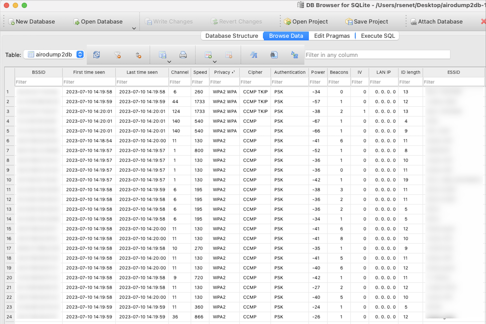

# About airodump2db

**airodump2db** was written in order to help any Wi-Fi penetration testers to transform airodump-ng output to SQLite database.


## Usage

Print the help to get all necessary information:

```bash
$ python3 airodump2db.py -h
usage: airodump2db.py [-h] [--input INPUT]

Airodump to SQLite database

options:
  -h, --help     show this help message and exit
  --input INPUT  Specify the CSV output from Airodump-ng (sudo airodump-ng INTERFACE -w FILENAME --output-format csv
```

You just have to specify the airodump-ng output (in CSV format):

```bash
$ python3 airodump2db.py --input myOutput-01.csv
Processed 67 lines.
```

## Output

The output is a SQLite database:



## Author

Régis SENET ([rsenet](https://github.com/rsenet))


## Contributing

Bug reports and pull requests are welcome on [GitHub](https://github.com/rsenet/airodump2db).

## License

The project is available as open source under the terms of the [GPLv3](https://www.gnu.org/licenses/quick-guide-gplv3.en.html)
